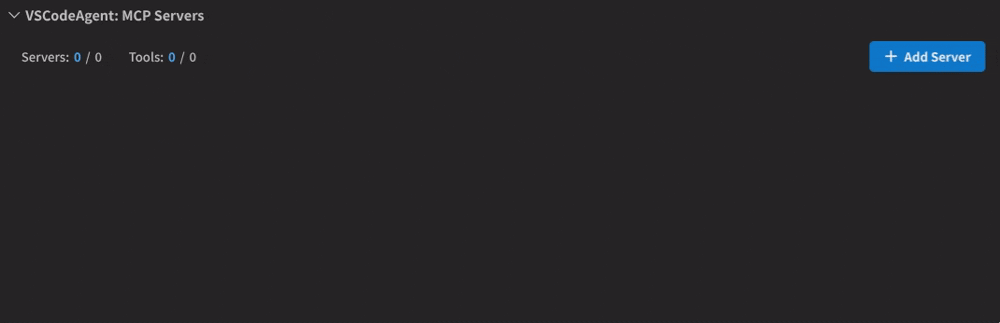
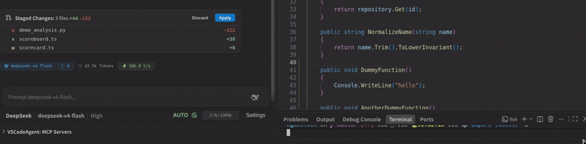
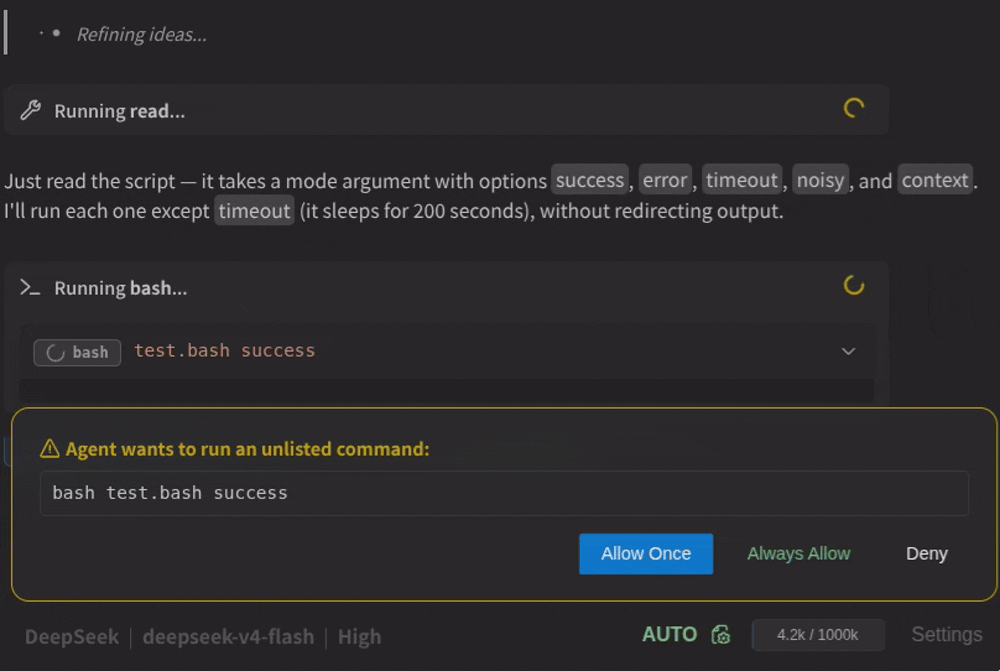
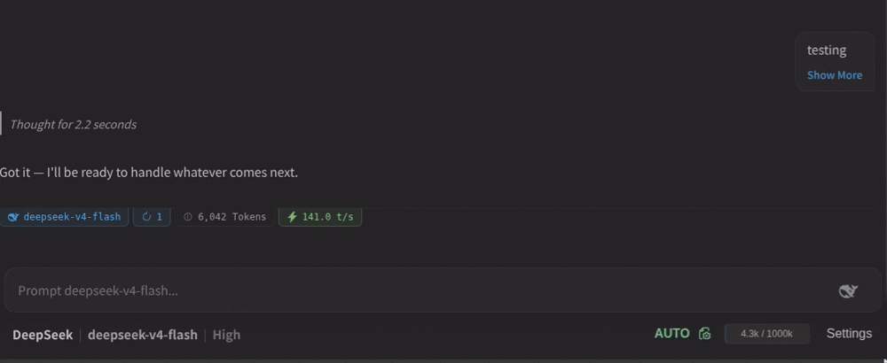
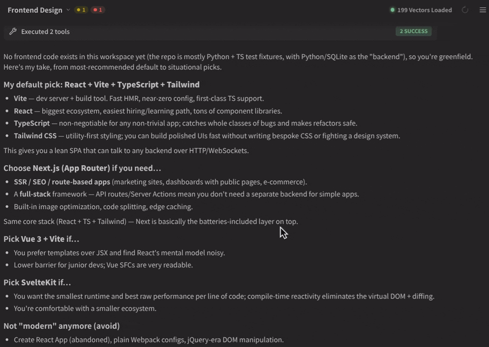
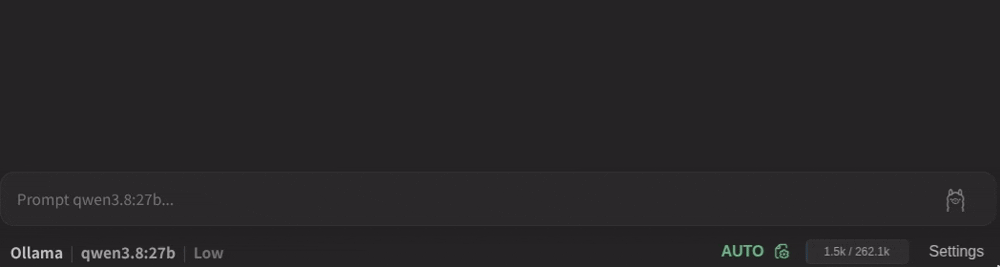

# Visual Studio Code Coding Harness
A multi-session autonomous development harness designed to inspect, edit and test code safely.

*I know copilot exists and this harness is not better or offers more features than other harnesses. This is just a personal project to learn the workings of agent harnesses.*

# Features

### RAG: Embedding Vector Indexing

Fast semantic searching in codebase with AST chunked vectors.

<p align="left">
  
</p>

- Automatic re-indexing on file changes.
- Currently supports:
  - C, C++
  - C#
  - Python
  - JavaScript, TypeScript
  - Rust
  - Go
  - Java

### Model Context Protocol (MCP) Support

Connects to external MCP servers using both standard I/O (stdio) and streamable HTTP transports.

<p align="left">
  
</p>

- Allows toggling individual tools.

- MCP server schemas are discovered on demand.

### Git Worktree Sandbox

Runs agent file operations inside detached Git worktrees to prevent destructive workspace overwrites.

<p align="left">
  
</p>

- Automatically reconciles dependencies by symlinking heavy directories.
- Provides diff view and conflict resolution (Merge Editor).

### Terminal Execution Sandbox
Regex-based command whitelist defined in agent-rules.json covering common build and query tools (git, cargo, npm, python, rg, etc.)

<p align="left">
  
</p>


- Path enforcement that blocks commands from executing outside the workspace root.
- Disallows command chaining.
- Configurable process timeout.
- Configurable command whitelist.
- Configurable autonomy tiers: Manual (prompts on every command), Semi-Autonomous (prompts only for unlisted commands), and Full Autonomous.

### Context & Token Lifecycle Optimization:

User configurable context management to reduce token usage.

<p align="left">
  
</p>

- Offloads lengthy tool inputs and outputs into retrievable artifacts.
- Compacts conversational turns into structured summaries.
- Dynamically injects remaining turn budgets into tool responses as the agent approaches turn limits.

### Multi-Session Management

Maintains isolated chat histories, custom configurations, and separate worktrees per session.

<p align="left">
  
</p>

- Notifies user when background sessions require actions or encounter errors.
- Automatic background session title generation using lightweight model.

### BYOK
Connect directly to cloud providers using API keys or run offline with Ollama.

<p align="left">
  
</p>

- API keys stored in encrypted secret storage.
- Uses new endpoints like OpenAI's responses and Gemini's interactions when supported.
- Currently supports:
  - OpenAI
  - Gemini
  - Claude
  - DeepSeek
  - Kimi
  - Ollama


# Prerequistes
 - Git
 - VS Code `^1.120.0` or higher
 - (Optional) Ollama for local inference and embedding
 - (Optional) npx for MCP servers

# Installation
Download the .vsix file from the release page for your platform.

# Building

**Prerequisites**
* Node.js `v20+` and npm

**1. Clone & Install Dependencies**
```bash
git clone https://github.com/keqiq/CodeAgent.git
cd CodeAgent
npm install
```

**2. Packaging a `.vsix` Installer**

Because the project relies on native modules (`@lancedb/lancedb`, `web-tree-sitter`), packages must be targeted to your specific operating system and architecture:

* **Linux (x64):**
  ```bash
  npm run package:linux-x64
  ```
* **macOS (Apple Silicon):**
  ```bash
  npm run package:mac-arm64
  ```
* **Windows (x64):**
  ```bash
  npm run package:win-x64
  ```
* **macOS (Intel):**
  Missing native lancedb binding.

# License

This project is licensed under the [MIT License](LICENSE).